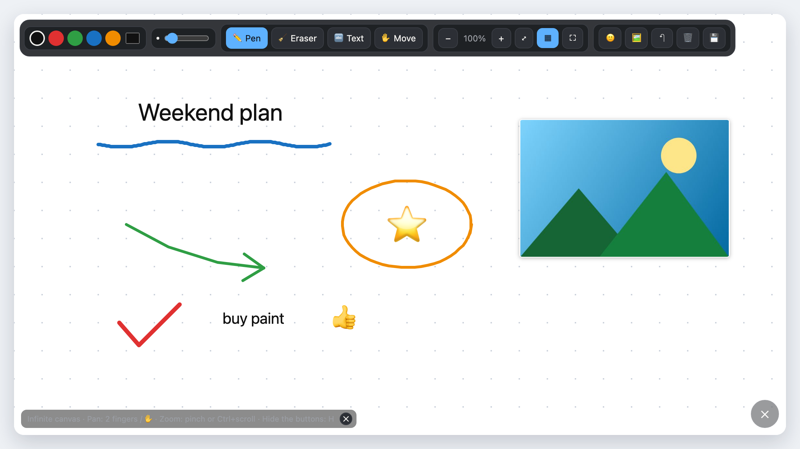
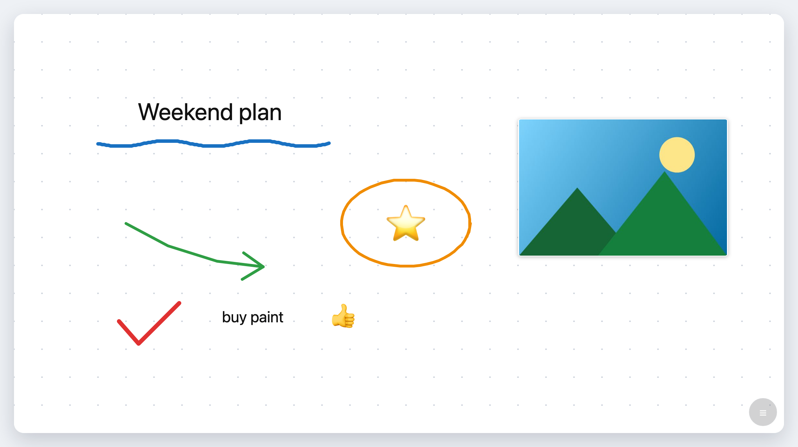
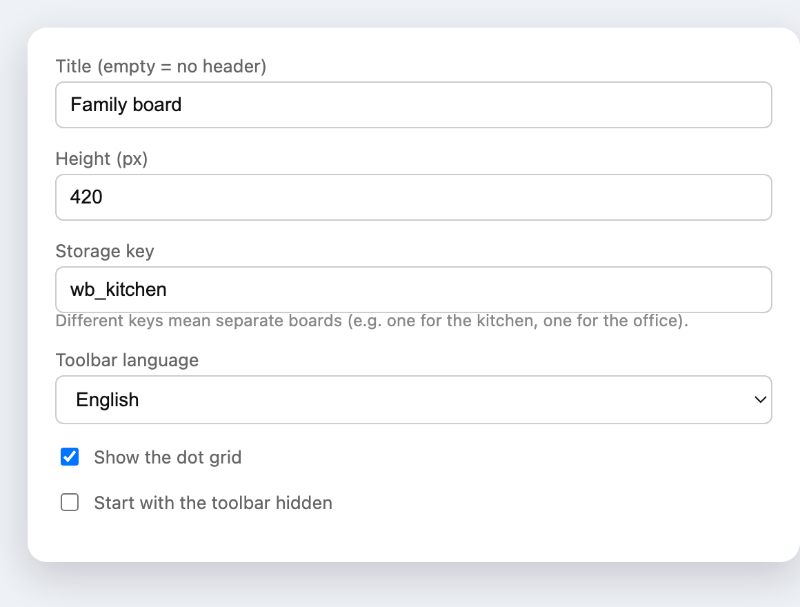

<h1 align="center">Whiteboard Card pentru Home Assistant</h1>

<p align="center">
  <a href="https://github.com/hacs/integration"></a>
  <a href="https://github.com/Dorin-Irimia/ha-whiteboard/releases"></a>
  <a href="LICENSE"></a>
</p>

<p align="center"><a href="README.md">🇬🇧 English</a> · <b>🇷🇴 Română</b></p>

<p align="center">
  O tablă de desen cu pânză infinită pentru dashboard-ul Home Assistant.<br>
  Desenezi cu degetul sau cu mouse-ul, lipești poze, adaugi emoji și note text, te miști și dai zoom la nesfârșit.<br>
  Fără cloud, fără integrare, fără build — un singur fișier JavaScript care rulează în browserul tău.
</p>

<p align="center"></p>

---

## Cuprins

1. [Prezentare](#1-prezentare)
   - [1.1 Capturi de ecran](#11-capturi-de-ecran)
   - [1.2 Lista de funcții](#12-lista-de-funcții)
2. [Cerințe preliminare](#2-cerințe-preliminare)
3. [Instalare](#3-instalare)
   - [3.1 Prin HACS (recomandat)](#31-prin-hacs-recomandat)
   - [3.2 Instalare manuală](#32-instalare-manuală)
   - [3.3 Înregistrarea resursei](#33-înregistrarea-resursei)
4. [Configurare](#4-configurare)
   - [4.1 Opțiunile cardului](#41-opțiunile-cardului)
   - [4.2 Limba](#42-limba)
   - [4.3 Rețete de așezare în pagină](#43-rețete-de-așezare-în-pagină)
   - [4.4 Varianta iframe](#44-varianta-iframe)
5. [O singură tablă pentru toți](#5-o-singură-tablă-pentru-toți)
   - [5.1 Instalarea integrării](#51-instalarea-integrării)
   - [5.2 Cum funcționează partajarea](#52-cum-funcționează-partajarea)
   - [5.3 Limitări](#53-limitări)
6. [Utilizare](#6-utilizare)
   - [6.1 Comenzi](#61-comenzi)
   - [6.2 Imagini și stickere](#62-imagini-și-stickere)
   - [6.3 Salvare și export](#63-salvare-și-export)
7. [Probleme frecvente](#7-probleme-frecvente)
8. [Actualizare](#8-actualizare)
9. [Dezvoltare](#9-dezvoltare)
   - [9.1 Structura repo-ului](#91-structura-repo-ului)
   - [9.2 Adăugarea unei limbi](#92-adăugarea-unei-limbi)
10. [Licență](#10-licență)

---

## 1. Prezentare

### 1.1 Capturi de ecran

**Mod curat** — un singur buton (sau tasta `H`) ascunde toată bara de unelte și lasă doar tabla:



**Editor vizual** — nu ai nevoie de YAML ca să configurezi cardul:



### 1.2 Lista de funcții

- **Pânză infinită** — desenul nu e limitat la ecran. Te miști în orice direcție și desenezi mai
  departe. Traseele sunt vectoriale, deci rămân clare la orice nivel de zoom.
- **Interfață ascundibilă** — butonul rotund din dreapta jos (sau tasta `H`) ascunde toată bara de
  unelte. Starea se ține minte la reîncărcare.
- **Imagini și stickere** — lipești cu `Ctrl+V`, tragi fișierul peste tablă, sau alegi o poză din
  telefon. Imaginile se mută și se redimensionează ca orice alt obiect, păstrându-și proporțiile.
- **Emoji și note text** — se mută și se redimensionează independent (colțul albastru = resize,
  `✕` roșu = șterge).
- **Radieră care taie traseele** în bucăți, în loc să picteze cu alb peste ele.
- **Bară de unelte multilingvă** — engleză implicit, 7 limbi incluse, sau după limba din
  Home Assistant.
- Grilă de puncte opțională, buton de ecran complet, undo (`Ctrl+Z`), șterge tot.
- **Export PNG** al *întregului* conținut, nu doar al zonei vizibile.
- **Mai multe table independente** pe același dashboard, prin `storage_key`.
- **Tablă partajată, opțional** — instalezi integrarea din acest repo și toți utilizatorii și toate
  device-urile desenează pe aceeași tablă, în timp real. Fără ea, fiecare browser are tabla lui.
- Totul rămâne pe mașina ta — nimic nu iese din rețeaua ta.

---

## 2. Cerințe preliminare

| Cerință | Detalii |
|---------|---------|
| Home Assistant | 2022.5 sau mai nou. HACS ascunde repo-urile care cer un core mai nou decât al tău, deci verifică **Settings → About** dacă repo-ul nu apare în căutare. |
| HACS | Doar pentru instalarea prin HACS — [ghid de instalare](https://hacs.xyz/docs/use/download/download/). Instalarea manuală merge și fără el. |
| Dashboard | Un dashboard pe care îl poți edita. Dacă ai Lovelace în **mod YAML**, resursa trebuie adăugată de mână — vezi [3.3](#33-înregistrarea-resursei). |
| Browser | Orice browser modern (Chrome, Edge, Firefox, Safari) sau aplicația Home Assistant Companion. Merge cu degetul și cu stylusul. |

**Pentru card nu e nevoie de:** restart la Home Assistant, custom component, acces la internet sau
cont de cloud. Integrarea opțională, pentru tabla partajată, e la
[capitolul 5](#5-o-singură-tablă-pentru-toți).

> **Unde se salvează desenele?** Implicit în `localStorage`-ul browserului, separat pe fiecare
> device — o tablă desenată pe tableta din bucătărie nu se vede pe telefon. Instalează integrarea
> opțională ([capitolul 5](#5-o-singură-tablă-pentru-toți)) ca să ai o singură tablă, comună tuturor
> utilizatorilor și tuturor device-urilor.

---

## 3. Instalare

### 3.1 Prin HACS (recomandat)

Repo-ul nu e (încă) în magazinul implicit HACS, deci se adaugă ca **custom repository**.

**Pasul 1 — adaugă repo-ul**

1. Deschide **HACS** din bara laterală Home Assistant
2. Meniul cu **trei puncte** (⋮) din dreapta sus → **Custom repositories**
3. Completează fereastra:
   - **Repository:** `https://github.com/Dorin-Irimia/ha-whiteboard`
   - **Type / Category:** **Dashboard** *(pe HACS mai vechi de v2 se numește „Lovelace" sau „Plugin")*
4. Apasă **ADD**, apoi închide fereastra

**Pasul 2 — descarcă**

5. Caută **Whiteboard Card** în HACS — apare imediat după adăugarea repo-ului
6. Deschide-l → **DOWNLOAD** (dreapta jos) → confirmă versiunea → **DOWNLOAD**

HACS pune fișierul în `config/www/community/ha-whiteboard/whiteboard-card.js` și **adaugă singur
resursa Lovelace**, dacă dashboard-urile tale sunt gestionate din interfață.

**Pasul 3 — golește cache-ul browserului**

7. Apasă **`Ctrl` + `Shift` + `R`** (sau `Ctrl+F5`)

Pe aplicația Companion: **Settings → Companion App → Debugging → Reset frontend cache**, sau închide
complet aplicația și redeschide-o. Pasul ăsta e cauza numărul unu pentru
*„Custom element doesn't exist"*.

**Pasul 4 — adaugă cardul în dashboard**

8. Deschide dashboard-ul → **✏️** (mod editare) → **+ ADD CARD**
9. Caută **Whiteboard** și alege-l
10. Reglează setările din editorul vizual → **SAVE**

### 3.2 Instalare manuală

```bash
git clone https://github.com/Dorin-Irimia/ha-whiteboard.git
cd ha-whiteboard
chmod +x install.sh
./install.sh /calea/catre/config/home-assistant
```

Sau pur și simplu copiază fișierele în folderul de config:

```bash
cp dist/whiteboard-card.js dist/whiteboard.html /calea/catre/config/www/
```

Folderul `www` e servit automat la `/local/...`, deci URL-ul resursei devine
`/local/whiteboard-card.js`.

### 3.3 Înregistrarea resursei

Necesară doar la instalarea manuală, sau dacă Lovelace rulează în mod YAML.

**Dashboard-uri gestionate din interfață:** **Settings → Dashboards → ⋮ → Resources → Add resource**

| Câmp | Valoare |
|------|---------|
| URL | `/local/community/ha-whiteboard/whiteboard-card.js` (HACS) sau `/local/whiteboard-card.js` (manual) |
| Type | **JavaScript Module** |

**Mod YAML** — în `configuration.yaml`, în blocul `lovelace:` pe care îl ai deja:

```yaml
lovelace:
  resources:
    - url: /local/whiteboard-card.js?v=1
      type: module
```

Resursele declarate în YAML se citesc doar la pornire, deci **repornește Home Assistant** după.
Crește numărul din `?v=` la fiecare actualizare, altfel browserul îți servește fișierul din cache.

---

## 4. Configurare

### 4.1 Opțiunile cardului

```yaml
type: custom:whiteboard-card
title: Whiteboard
height: 420
```

| Opțiune | Implicit | Descriere |
|---------|----------|-----------|
| `title` | — | Titlul cardului; lipsește = card fără antet |
| `height` | `420` | Înălțimea zonei de desen: număr (px) sau text (`85vh`) |
| `grid` | `true` | Grila de puncte |
| `hide_toolbar` | `false` | Pornește cu bara de unelte ascunsă |
| `storage_key` | `ha_whiteboard_v3` | Cheia de stocare — o cheie diferită înseamnă o tablă separată |
| `language` | `en` | Limba barei de unelte, vezi [4.2](#42-limba) |

### 4.2 Limba

Bara de unelte e **în engleză implicit**. Limbi incluse:

| Cod | Limbă | Cod | Limbă |
|-----|-------|-----|-------|
| `en` | English | `es` | Español |
| `ro` | Română | `it` | Italiano |
| `de` | Deutsch | `nl` | Nederlands |
| `fr` | Français | | |

```yaml
type: custom:whiteboard-card
language: ro
```

Cu `language: auto` se ia limba utilizatorului conectat în Home Assistant, cu revenire la engleză
dacă limba aceea nu e tradusă încă. Pe pagina de sine stătătoare folosești `?lang=ro`.

### 4.3 Rețete de așezare în pagină

**Tablă pe tot ecranul** — un view cu `panel: true`:

```yaml
views:
  - title: Tablă
    panel: true
    cards:
      - type: custom:whiteboard-card
        height: 85vh
```

**Mai multe table independente:**

```yaml
- type: custom:whiteboard-card
  title: Bucătărie
  storage_key: wb_bucatarie

- type: custom:whiteboard-card
  title: Birou
  storage_key: wb_birou
```

### 4.4 Varianta iframe

Merge fără să înregistrezi vreo resursă:

```yaml
type: iframe
url: /local/whiteboard.html
aspect_ratio: 90%
```

Pagina acceptă parametri: `?key=birou` (tablă separată), `?lang=ro` (limba),
`?grid=0` (fără grilă), `?clean=1` (pornește cu butoanele ascunse).

HACS descarcă doar fișierul JavaScript, așa că dacă vrei și varianta iframe, copiază
`dist/whiteboard.html` lângă el, în `config/www/community/ha-whiteboard/`, și folosește
`/local/community/ha-whiteboard/whiteboard.html`.

---

## 5. O singură tablă pentru toți

Implicit, cardul rulează exclusiv în frontend: fiecare browser își ține tabla lui în `localStorage`,
deci ce desenezi pe telefon nu ajunge niciodată pe laptop. Dacă instalezi integrarea opțională din
acest repo, toate browserele din casă folosesc **o singură** tablă — oricine poate deschide
dashboard-ul poate desena pe ea, și toată lumea vede rezultatul.

### 5.1 Instalarea integrării

Integrarea **servește și cardul**, deci asta e cea mai scurtă instalare: o singură intrare în HACS,
niciun fișier de copiat în `www/` și nicio resursă Lovelace de înregistrat — adică merge și pe
Home Assistant OS, și cu Lovelace în mod YAML.

**Prin HACS**

1. HACS → ⋮ → **Custom repositories**
   - Repository: `https://github.com/Dorin-Irimia/ha-whiteboard`
   - Category: **Integration**
2. Caută **Whiteboard** în HACS → **DOWNLOAD**
3. **Repornește Home Assistant** — o integrare se încarcă doar la pornire
4. **Settings → Devices & Services → + Add integration → Whiteboard** → Submit

Dacă HACS refuză repo-ul pentru că l-ai adăugat deja ca *Dashboard*, șterge întâi intrarea aceea
(HACS → Whiteboard Card → ⋮ → Remove) și adaug-o din nou ca **Integration**.

**Manual** — copiezi folderul și repornești:

```bash
cp -r custom_components/ha_whiteboard /calea/catre/config/custom_components/
```

În loc de pasul cu adăugarea integrării din interfață, poți pune o singură linie în
`configuration.yaml`:

```yaml
ha_whiteboard:
```

Oricum ai face, cardul observă singur integrarea și trece de la stocarea pe browser la tabla
partajată. Fără integrare, funcționează exact ca înainte.

**A mers?** În bara de unelte apare ☁️ pentru tablă partajată și 🖥️ pentru tablă locală.

### 5.2 Cum funcționează partajarea

- Tabla stă în `.storage/ha_whiteboard.boards`, pe mașina ta cu Home Assistant. Nimic nu pleacă
  în altă parte.
- Fiecare traseu și fiecare obiect are id-ul lui, iar clienții trimit doar ce s-a schimbat, deci
  **doi oameni pot desena în același timp** și se păstrează ambele desene. Nu există suprascriere.
- Modificările circulă pe conexiunea websocket existentă, deci un traseu desenat pe telefon apare
  pe tabletă în aproximativ o secundă, fără reîncărcare.
- **Zoomul și poziția rămân locale** fiecărui device — fiecare se poate uita în alt colț al
  aceleiași table.
- `storage_key` alege ce tablă partajată primești. Două carduri cu chei diferite sunt două table
  partajate independente.
- Ce aveai desenat local înainte de instalare se urcă pe server la prima conectare, deci nu pierzi
  nimic.
- Orice utilizator autentificat poate desena. Nu se cere drept de administrator și nu există
  separare pe utilizatori — asta e ideea unei table de familie.

### 5.3 Limitări

- **Varianta `iframe` nu se poate sincroniza.** O pagină obișnuită nu are acces la conexiunea cu
  Home Assistant, deci `/local/whiteboard.html` rămâne mereu per-browser. Pentru tablă partajată
  folosește custom card-ul.
- O tablă e limitată la 8 MB. E foarte mult desen, dar doar câteva poze — cardul te anunță când s-a
  atins limita, în loc să eșueze în tăcere.
- Undo e local: anulează *ultima ta* acțiune, iar rezultatul se sincronizează. Nu poate anula ce a
  desenat altcineva.

---

## 6. Utilizare

### 6.1 Comenzi

| Acțiune | Cum |
|---------|-----|
| Desen | Mouse sau deget |
| Mutarea pânzei | Două degete, unealta `✋`, rotița mouse-ului, sau click mijloc/dreapta |
| Zoom | Pinch, `Ctrl` + scroll, sau butoanele `+` / `−` |
| Înapoi la origine | `⤢` |
| Ascunde / arată butoanele | Butonul rotund, sau tasta `H` |
| Anulare | `↶` sau `Ctrl+Z` |
| Mută sau redimensionează un obiect | Îl tragi; colțul albastru redimensionează; `✕` îl șterge |
| Editează o notă text | Dublu-click pe ea |
| Export PNG | `💾` |

### 6.2 Imagini și stickere

Trei feluri de a pune o poză pe tablă:

- **Lipire** — copiezi o imagine de oriunde și apeși `Ctrl+V` cu cursorul deasupra tablei
- **Drag & drop** — tragi fișierul imagine direct peste tablă
- **Butonul 🖼️** — deschide selectorul de fișiere; pe telefon sau tabletă îți oferă camera și
  galeria foto, cea mai rapidă cale de a transforma o poză în sticker

Imaginile se comportă ca orice alt obiect: le tragi ca să le muți, tragi colțul albastru ca să le
redimensionezi (proporțiile se păstrează), `✕` le șterge.

Pozele sunt micșorate la 1000 px pe latura lungă înainte de salvare, ca o poză de telefon să nu
umple spațiul de stocare al browserului. Imaginile cu transparență rămân PNG, ca stickerele
decupate să rămână transparente; restul se salvează ca JPEG. Dacă totuși se umple spațiul, tabla îți
spune, în loc să-ți piardă lucrul în tăcere.

### 6.3 Salvare și export

**Tabla se salvează singură.** Fiecare linie, notă și imagine se scrie automat în spațiul de stocare
al browserului — nu există buton de „salvează" de apăsat, iar la reîncărcarea paginii revine tot,
inclusiv poziția și zoomul la care rămăseseși.

**Butonul 💾 exportă un PNG** cu toată tabla — tot conținutul, nu doar partea vizibilă. În cardul
`iframe`, Home Assistant blochează descărcările (sandbox-ul nu are `allow-downloads`), așa că
imaginea se deschide într-o filă nouă, de unde o poți salva. În custom card descărcarea merge direct.

---

## 7. Probleme frecvente

| Simptom | Cauză și rezolvare |
|---------|--------------------|
| `Custom element doesn't exist: whiteboard-card` | Cache-ul browserului. Reîncarcă forțat. Dacă persistă, verifică în **Settings → Dashboards → ⋮ → Resources** URL-ul și că tipul e **JavaScript Module**. |
| *„Your resources are in YAML mode"* în loc de lista de resurse | Lovelace e în mod YAML, HACS nu poate înregistra resursa. O adaugi în `configuration.yaml` și repornești — vezi [3.3](#33-înregistrarea-resursei). |
| Cardul apare, dar e gol sau turtit | Mărește `height`, sau folosește un view cu `panel: true`. |
| HACS refuză să adauge repo-ul | Categoria trebuie să fie **Dashboard** (nu Integration), iar URL-ul trebuie să înceapă cu `https://`. |
| PNG-ul nu se descarcă niciodată | Folosești cardul `iframe` — imaginea se deschide într-o filă nouă. Permite pop-up-urile pentru adresa Home Assistant. |
| *„Spațiul de stocare e plin"* | Prea multe imagini pe o singură tablă. Șterge câteva, sau mută-le pe o a doua tablă cu propriul `storage_key`. |
| Alegerea unei poze nu face nimic **în aplicația Companion**, dar merge în browserul telefonului | Webview-ul aplicației nu deschide selectorul de fișiere. Verifică Android → Setări → Aplicații → Home Assistant → Permisiuni → **Fotografii și videoclipuri**, și actualizează aplicația. Până atunci, adaugă pozele din browser; restul funcționează normal în aplicație. |
| Tabla e goală pe alt device | Normal — tablele se salvează per browser, nu există sincronizare. |

---

## 8. Actualizare

**HACS:** la fiecare release nou apare o notificare → **HACS → Whiteboard Card → UPDATE**, apoi
reîncarcă forțat browserul. Resursa nu trebuie reconfigurată.

**Manual:**

```bash
cd ha-whiteboard
git pull
./install.sh /calea/catre/config
```

Dacă ai înregistrat resursa în mod YAML, nu uita să crești `?v=` în `configuration.yaml`.

---

## 9. Dezvoltare

### 9.1 Structura repo-ului

```
dist/whiteboard-card.js       motorul de desen + elementul custom:whiteboard-card
dist/whiteboard.html          pagina de sine stătătoare (varianta iframe), același motor
custom_components/ha_whiteboard/  integrarea opțională: table partajate și persistente
docs/                         capturile de ecran folosite în acest README
install.sh                    copiază fișierele de frontend în folderul de config
hacs.json                     metadate HACS
```

Cardul nu are pas de build și nicio dependință. Editezi `dist/whiteboard-card.js`, reîncarci, gata.
Integrarea e un component Home Assistant obișnuit și cere restart ca să se reîncarce.

### 9.2 Adăugarea unei limbi

Deschizi `dist/whiteboard-card.js`, cauți obiectul `I18N`, copiezi blocul `en`, traduci valorile și
adaugi numele limbii în `LANGUAGE_NAMES`. Cheile lipsă revin automat la engleză.
Pull request-urile cu limbi noi sunt binevenite.

---

## 10. Licență

MIT — vezi [LICENSE](LICENSE).
